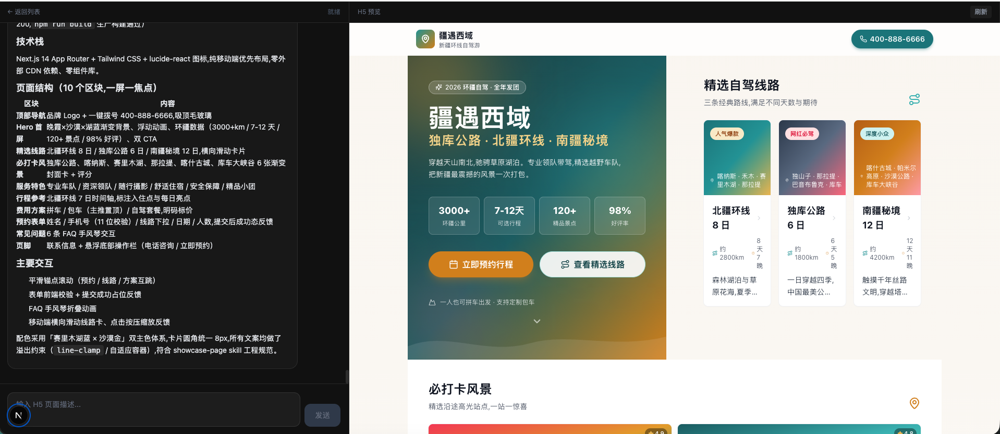

# AI 工作区平台

使用 `@anthropic-ai/claude-agent-sdk` + DeepSeek 模型实现的 AI 项目工作区。核心创新是通过一个 **OpenAI 兼容代理层**，让 Anthropic SDK 透明地使用 DeepSeek 模型。

## 项目展示



## 架构

```
h5-platform/
├── backend/                          # Nest.js
│   ├── src/
│   │   ├── main.ts                   # 启动入口，CORS + Socket.IO 预览推送
│   │   ├── app.module.ts             # 根模块
│   │   ├── platform/                 # Skill/MCP 配置管理
│   │   ├── realtime/                 # Socket.IO 实时通道
│   │   ├── preview/                  # 预览代理
│   │   ├── proxy/
│   │   │   ├── proxy.controller.ts   # POST /v1/messages (Anthropic 兼容接口)
│   │   │   └── proxy.service.ts      # Anthropic ↔ OpenAI/DeepSeek 格式转换
│   │   ├── chat/
│   │   │   ├── chat.controller.ts    # POST /chat/send (SSE), GET /chat/conversations
│   │   │   ├── chat.service.ts       # 业务编排 + DB 持久化
│   │   │   └── deepseek.service.ts   # DeepSeek 直接调用
│   │   ├── agent-sdk/
│   │   │   ├── agent-run.service.ts     # 运行协调：续跑/重连/全量 snapshot
│   │   │   ├── agent-sdk.controller.ts  # POST /agent/run, GET /agent/status
│   │   │   └── agent-sdk.module.ts
│   │   ├── sandbox/
│   │   │   └── sandbox-service-client.ts # 主服务 → sandbox 服务 HTTP/SSE 客户端
│   │   ├── conversation/
│   │   │   ├── conversation.service.ts
│   │   │   └── entities/
│   │   │       ├── conversation.entity.ts
│   │   │       └── message.entity.ts
│   │   ├── output-dir.ts                # 统一 h5-output 路径解析
│   │   └── database/
│   │       └── database.module.ts    # TypeORM + SQLite
│   ├── .env                          # DeepSeek API Key
│   └── data/h5-platform.db           # SQLite 数据库
├── sandbox/                          # 独立 Agent 沙箱服务
│   ├── package.json
│   ├── tsconfig.json
│   ├── src/
│   │   ├── service.ts                # HTTP 控制面 + SSE 事件流
│   │   ├── agent-sdk.service.ts      # 封装 @anthropic-ai/claude-agent-sdk query()
│   │   ├── preview-manager.ts        # 预览注册表、端口分配、健康检查、自动重启
│   │   ├── page-system-prompt.ts     # 展示页/后台页通用系统提示词
│   │   └── types.ts
│   ├── mcp/                          # workspace / preview MCP server
│   └── preview-registry.json         # 运行期生成：任务预览端口与状态
├── skills/                           # 生成技能源
│   ├── tailwind-showcase-page/
│   └── tailwind-admin-page/
├── frontend/                         # Next.js
│   └── app/
│       ├── page.tsx                  # 首页重定向到 /tasks
│       ├── tasks/                    # 任务列表
│       ├── skills/                   # Skill 管理
│       ├── mcps/                     # MCP 管理
│       ├── components/
│       │   ├── AdminShell.tsx        # 后台菜单壳
│       │   ├── ChatMessage.tsx       # 消息组件 (Markdown + skill/MCP/工具事件流)
│       │   └── PreviewPanel.tsx      # iframe 预览区
│       └── hooks/
│           └── useChatSSE.ts         # SSE 流式接收 + 事件归一化
└── .gitignore
```

## 核心创新：OpenAI 兼容代理层

`@anthropic-ai/claude-agent-sdk` 目前仅支持 Anthropic 系列模型。为了让 SDK 能使用 DeepSeek，我们实现了一个透明的格式转换代理层：

```
Anthropic Request                    OpenAI/DeepSeek Request
┌──────────────────────┐             ┌──────────────────────┐
│ POST /v1/messages    │    proxy    │ POST /v1/chat/       │
│ model: claude-...    │ ──────────→ │   completions         │
│ messages: [...]      │             │ model: deepseek-...   │
│ thinking: enabled    │   convert   │ messages: [...]       │
│ stream: true         │             │ extra_body: {         │
└──────────────────────┘             │   thinking_mode }     │
       ↕                             └──────────────────────┘
       │  convert back
       ↕
Anthropic SSE (message_start → thinking_delta → signature → text_delta → message_stop)
```

通过设置环境变量 `ANTHROPIC_BASE_URL=http://localhost:3001`，SDK 内部的所有 API 调用都会被重定向到我们的代理层，SDK 完全无感知。

转换层已覆盖以下兼容点：

- `toolu_xxx` ↔ `call_xxx` 工具调用 ID 全量往返，不截断，保证 tool_result 能对应到 assistant tool_use。
- 并行工具调用按 OpenAI stream index 分别累积参数，避免多个工具参数互相串线。
- `tool_result` 中的普通文本会保留为独立 user 消息，满足 OpenAI 消息顺序要求。
- 流式结束前会补全所有 thinking/text/tool 的 `content_block_stop`，避免悬挂 block。

## 完整数据流

```
Frontend (Next.js)
    ↓ POST /agent/run
AgentRunService
    ↓ SandboxServiceClient
    ↓ POST http://localhost:3002/tasks
Sandbox Service
    ↓ AgentSdkService.query()
    ↓ env: ANTHROPIC_BASE_URL=http://localhost:3001
Claude CLI
    ↓ POST http://localhost:3001/v1/messages
Main Service Proxy (Anthropic → OpenAI/DeepSeek)
    ↓ SSE events (thinking_delta, text_delta, ...)
Sandbox Service
    ↓ GET http://localhost:3002/tasks/:id/events
SandboxServiceClient → AgentRunService
    ↓ 增量落库 + SSE 广播
Frontend
```

当前实现中，主服务不运行 Claude SDK。`SandboxServiceClient` 通过 HTTP 创建沙箱任务，再通过 SSE 接收 `thinking/text/tool/skill/mcp` 事件流。

## API 端点

| 端点 | 说明 | 格式 |
|---|---|---|
| `POST /v1/messages` | Anthropic 兼容代理（供 SDK 调用） | Anthropic SSE 协议 |
| `POST /agent/run` | **SDK 全链路** query() → 代理 → DeepSeek | 自定义 SSE |
| `GET /agent/status` | 查询任务是否正在运行 | JSON |
| `GET /skills` | 读取已沉淀 skill 与启用状态 | JSON |
| `POST /skills/:name/toggle` | 切换 skill 启用状态 | JSON |
| `GET /mcps` | 读取可注入 MCP server 配置 | JSON |
| `POST /mcps/:name/toggle` | 切换 MCP server 启用状态 | JSON |
| `POST /chat/send` | 直接对话（直接调 DeepSeek） | 自定义 SSE |
| `GET /chat/conversations` | 对话列表 | JSON |
| `GET /chat/conversations/:id` | 对话详情 | JSON |

### Sandbox Service API

| 端点 | 说明 | 格式 |
|---|---|---|
| `POST /tasks` | 创建 Agent 任务 | JSON |
| `GET /tasks/:id/events` | Agent 事件流 | SSE |
| `GET /tasks/:id/status` | 任务状态 | JSON |
| `POST /preview/start` | 启动/确认预览服务 | JSON |
| `POST /preview/:taskId/restart` | 重启预览服务 | JSON |
| `GET /preview/:taskId/status` | 预览状态 | JSON |
| `GET /preview/:taskId/*` | 预览页面/静态资源代理 | HTML/CSS/JS |

### SSE 事件格式

`POST /agent/run` 使用以下事件格式；页面刷新重连时会先收到 `snapshot` 全量消息，再继续接收增量事件：

```
event: snapshot
data: {"messages":[...],"runStatus":"running"}

event: meta
data: {"conversationId":"...","messageId":"...","sdkSessionId":"..."}

event: thinking
data: {"content":"推理过程..."}

event: tool_start
data: {"toolName":"Write","toolId":"...","toolInput":{}}

event: tool_update
data: {"toolName":"Write","toolId":"...","toolInput":{"file_path":"sandbox/workspaces/<conversationId>/app/page.tsx"}}

event: text
data: {"content":"回复文本..."}

event: done
data: {"messageId":"...","usage":{"input_tokens":179,"output_tokens":30}}
```

Agent 运行过程中还会透出 `skill_load`、`skill_invoke`、`mcp_status`、`mcp_call` 事件，前端与 `thinking`、`tool_start` 等事件按时间顺序展示。

### Socket.IO 预览状态

任务页通过 Socket.IO 监听 `preview` 事件：

```text
{ "status": "starting" }
{ "status": "ready", "url": "http://localhost:3001/preview/<conversationId>" }
{ "status": "updated" }
{ "status": "error", "message": "..." }
```

只有 `ready` 会让前端 iframe 开始加载；`starting` 保持 loading；`updated` 会让已加载的 iframe 自动刷新；`error` 展示失败态。

`POST /agent/run` 支持两种模式：

```json
// 新建/继续一轮任务
{ "prompt": "生成一个后台任务列表页面", "conversationId": "..." }

// 页面刷新后重连正在运行的任务
{ "conversationId": "...", "resumeSessionId": "...", "reattach": true }
```

### 刷新续跑

- 后端任务由 `AgentRunService` 持有，不依赖单个 SSE 连接；页面刷新后任务继续执行。
- 任务运行时，thinking/text/tool 事件会增量写入 SQLite，连续 thinking/text 自动合并。
- 前端进入任务页先读取 `runStatus`；如果为 `running`，自动调用 `reattach` 重新连接。
- 后端进程重启后，可通过 `sdkSessionId` 使用 Claude SDK 的 resume 继续任务。

## Skill 与 MCP

- `skills/` 是平台技能源，当前包含 `tailwind-showcase-page` 和 `tailwind-admin-page`。
- 任务运行时，启用中的 skill 会复制到任务沙箱的 `.claude/skills`，并通过 SDK `skills` 选项注入。
- `workspace` MCP 负责沙箱内文件读写、搜索和路径校验。
- `preview` MCP 负责启动、停止和检查前端 dev server。
- 主服务通过 `/preview/:conversationId/*` 代理沙箱预览地址，不向前端直接暴露沙箱端口。
- 当 `preview` MCP 返回可访问地址时，后端通过 Socket.IO 向任务 room 推送 `preview` 事件，前端 iframe 自动切换。

## 主服务与沙箱通信

当前 `sandbox/` 已经是独立服务，与 `backend/`、`frontend/` 同级。主服务只通过 HTTP 控制面和 SSE 事件面调用沙箱：

```text
主服务 (Nest)
   │ 编排任务、持久化、SSE、预览代理
   │ POST /tasks
   │ GET  /tasks/:id/events (SSE)
   ▼
sandbox service (:3002)
   ├── Claude Agent SDK
   ├── skills 注入
   ├── workspace MCP
   └── preview MCP
```

通信职责：

```text
控制面：HTTP / gRPC
  POST /tasks
  GET  /tasks/:id/status
  POST /tasks 支持 dryRun: true，用于不调用模型验证事件链路

事件面：SSE / WebSocket / Socket.IO
  GET /tasks/:id/events
  chunk / error / end

预览面：
  Frontend → Main /preview/:conversationId
  Main → Sandbox /preview/:taskId/*
  Sandbox → PreviewRegistry → dev server
```

当前主服务 → 沙箱任务事件使用 SSE；主服务 → 前端预览状态使用 Socket.IO。预览状态分为 `starting`、`ready`、`error`，只有 sandbox 健康检查通过后才推送 `ready`。

### PreviewRegistry

- `sandbox/preview-registry.json` 持久化每个任务的预览记录：项目路径、端口、PID、状态、URL。
- 默认端口范围为 `4100-4200`，可分别用 `PREVIEW_PORT_START`、`PREVIEW_PORT_END` 调整。
- 端口启动后持久化，项目停止后释放并复用，不再依赖固定端口。
- `preview MCP` 和 sandbox HTTP 代理共用同一注册表。
- 健康检查失败时自动重启项目；重启失败不会无限重试。

```text
Frontend iframe
  ↓ /preview/:conversationId
Main Service
  ↓ /preview/:taskId/*
Sandbox Service
  ↓ PreviewRegistry 查询端口
  ↓ /_next/* 等静态资源同样走预览代理
沙箱内 dev server
```

隔离约束：

- 沙箱不直接访问宿主机文件系统，文件读写只通过 workspace MCP/沙箱 API。
- 沙箱不直接持有 DeepSeek key，只访问主服务的 Anthropic 兼容代理。
- dev server 不暴露给外网，主服务通过 `/preview/:conversationId/*` 代理访问。
- 主服务不直接跑 SDK，只做编排、持久化、代理和事件分发。

## 数据库模型

### Conversation
| 字段 | 类型 | 说明 |
|---|---|---|
| id | UUID | 主键 |
| title | string | 对话标题 |
| sdkSessionId | string | Claude SDK 会话 ID，用于 resume |
| outputDir | string | 该任务固定的 sandbox 工作区路径 |
| status | string | active / archived |
| runStatus | string | idle / running / completed / error |
| outputFiles | text | 生成的输出文件路径 JSON |
| createdAt | datetime | 创建时间 |
| updatedAt | datetime | 更新时间 |

### Message
| 字段 | 类型 | 说明 |
|---|---|---|
| id | UUID | 主键 |
| role | 'user' \| 'assistant' | 消息角色 |
| content | text | 消息内容 |
| thinkingChain | text | DeepSeek 思考链（reasoning_content） |
| events | text | 按时间顺序保存的 thinking/tool/text 事件 JSON |
| conversationId | UUID | 外键 |
| createdAt | datetime | 创建时间 |

## 页面生成系统提示词

`sandbox/src/page-system-prompt.ts` 提供展示页/后台页通用规则，会追加到 Claude Code 默认系统提示词之后：

- 普通展示类/H5 页面使用 Next.js + Tailwind CSS，优先移动端布局。
- 后台类页面使用 Next.js + Tailwind CSS，包含菜单、列表、表单、详情和状态管理。
- 不引入 antd、antd-mobile，不依赖外部 CDN 作为运行时依赖。
- 所有文件写入当前沙箱工作区，不能写外部绝对路径。
- 使用 workspace MCP 读写项目文件，使用 preview MCP 启动并验证页面。
- 用户明确要求单文件 HTML 时，才生成自包含静态页面作为 fallback。

## 输出目录约束

- 新任务的工作区统一放在 `sandbox/workspaces/<conversationId>/`，每个任务独立目录。
- `sandbox/src/agent-sdk.service.ts` 通过 `PreToolUse` hook 把 `Write` / `Edit` 的外部路径重写到当前任务工作区。
- Bash 中明显写到工作区之外的重定向、`mkdir`、`touch` 等操作会被拒绝。
- 旧任务的单文件 HTML 仍由主服务从 `backend/h5-output` 读取，兼容历史数据。

## 快速开始

### 前提

- Node.js >= 18
- DeepSeek API Key（从 [platform.deepseek.com](https://platform.deepseek.com) 获取）
- Claude CLI：`npm install -g @anthropic-ai/claude-code`（SDK 全链路需要）

### 安装与运行

```bash
# 1. 安装沙箱依赖
cd sandbox
npm install --legacy-peer-deps

# 2. 安装后端依赖
cd backend
npm install --legacy-peer-deps

# 3. 配置环境变量
cp .env.example .env
# 编辑 .env，填入你的 DEEPSEEK_API_KEY

# 4. 新终端，安装前端依赖
cd frontend
npm install --legacy-peer-deps

# 5. 分别启动三个服务
cd ../sandbox && npm run start
cd ../backend && npm run start:dev
cd ../frontend && npm run dev

# 6. 浏览器打开 http://localhost:3000
```

也可以直接运行根目录 `./start.sh` 一键启动三个服务：

```text
前端:  http://localhost:3000
后端:  http://localhost:3001
沙箱:  http://localhost:3002
```

## 技术栈

- **后端框架**: Nest.js 11
- **沙箱服务**: 独立 Node.js 服务
- **AI SDK**: @anthropic-ai/claude-agent-sdk
- **AI 模型**: DeepSeek（通过 OpenAI 兼容 API 调用）
- **数据库**: SQLite + TypeORM
- **前端框架**: Next.js 15 + React 19
- **样式**: Tailwind CSS 4
- **Markdown**: react-markdown + remark-gfm
